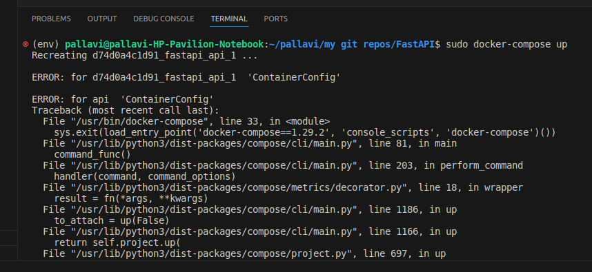

if you face the below error
- 

### SOL : 
    - use `docker compose` instead of `docker-compose up`
    - https://askubuntu.com/questions/1508129/docker-compose-giving-containerconfig-errors-after-update-today